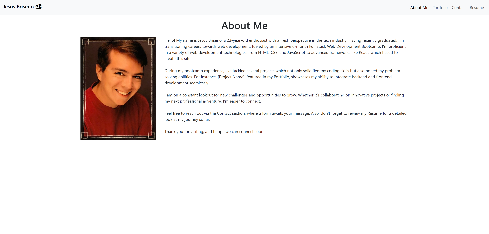

# React Portfolio

## Description

This is a website created using React + Vite deployed on Netlify. It contains basic information as well as links to projects, a contact form, and a resume.

## Table of Contents

* [Usage](#usage)

* [License](#license)

* [Credits](#credits)

* [Questions](#questions)

## Usage

Follow [this](https://jesus-briseno-portfolio.netlify.app/) link to open the application.

On opening the application, you will see the following page:

The user can then read or navigate to other sections of the website via the navigation bar.

## License

N/A

## Credits

N/A

## Questions

If you have any questions about the repo, open an issue or contact me directly at jbriseno2000@gmail.com. You can find more of my work at [jb6131](https://github.com/jb6131/).